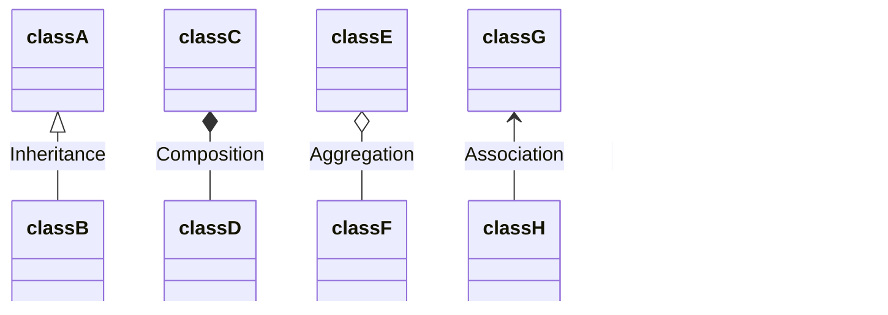

# Class Diagram

#### Daftar Isi

1. [Apa itu Class Diagram](#apa-itu-class-diagram)
1. [Alat untuk menggambar Class Diagram](#alat-untuk-menggambar-class-diagram)
1. [Visibility](#visibility)
1. [Menuliskan atribut](#menuliskan-atribut)
1. [Menuliskan methods](#menuliskan-methods)
1. [Static atribut/method](#static-atributmethods)
1. Coming Soon
1. [Relasi antar class](#relasi-antar-class)

#### Apa itu Class Diagram

Class Diagram adalah sebuah diagram/gambar dari susunan class yang ada pada kode OOP. Kegunaan class dapat digunakan sebagai dokumentasi / spesifikasi.
Pada class diagram kita dapat menggambarkan seperti nama class, atribut pada class, method pada class, dan relasi class satu dengan class yang lain.

Sebagai contoh sebuah `class Employee` dapat digambarkan dengan:


Pada class diagram terdapat 3 baris, baris pertama beirisi tentang informasi class, baris kedua berisi atribut yang dimiliki class, dan baris ketiga berisi methods yang dimiliki class.

#### Alat untuk menggambar Class Diagram

Banyak tools yang bisa digunakan untuk menggambar Class Diagram, baik itu gratis maupun berbayar. Adapula tools yang dapat langsung digunakan melalui web browser. Contoh tools yang dapat digunakan:

1. [VisualParadigm](https://online.visual-paradigm.com/diagrams/solutions/free-class-diagram-tool/) (online web browser)
1. [Creately](https://creately.com/diagram-type/class-diagram/) (online web browser)
1. [yEd graph editor](https://www.yworks.com/products/yed) (free download)
1. [Enterprise Architect](https://sparxsystems.com/products/ea/) (berbayar)

#### Visibility

Sebelum menggambarkan Class Diagram, perlu tahu terlebih dahulu mengenai. Visibility merupakan simbol yang menggambarkan _access modifiers_ pada kode program. Apabila tidak ada _access modifiers_, maka visibility dapat diabaikan

- `+` untuk _public_
- `-` untuk _private_
- `#` untuk _protected_
- `~` untuk _internal_

#### Menuliskan Atribut

Atribut-atribut yang dimiliki suatu class dituliskan pada baris kedua di Class Diagram. Format penulisan attribut:
`visibility namaAtribut: tipeData`
atau:
`visibility tipeData namaAtribut`

Misal memiliki kode:

```cs
class Kendaraan
{
  public string warna;
  public int jumlahRoda;
}
```

Digambarkan dengan:


#### Menuliskan Methods

Methods yang dimiliki suatu class dituliskan pada baris ketiga di Class Diagram. Format penulisan method:
`visibility namaMethod(parameter: tipeData): tipeDataReturn`
atau:
`visibility namaMethod(tipeData parameter): tipeDataReturn`

Misal memiliki kode:

```cs
class Kendaraan
{
  public void Gas()
  {
    Console.WriteLine("Kendaraan melaju dengan sangat cepat");
  }
}
```

```cs
class Matematika
{
  public int Penjumlahan(int angka1, int angka2)
  {
    return angka1 + angka2
  }
}
```

Digambarkan dengan:


#### Static Atribut/Methods

Sebuah static atribut/method digambarkan dengan garis dibawah teks, seperti:


#### Abstract

> 404, c0M1N9 5o0|\\|

#### Relasi antar class

Pada Class Diagram, kita juga dapat menggambarkan relasi antar class. Sebagai contoh relasi inheritance seperti berikut:

```cs
class Employee
{
}
class FrontEndDev : Employee
{
}
```

digambarkan dengan:


<br/>
Sejumlah relasi yang dapat digambarkan:


